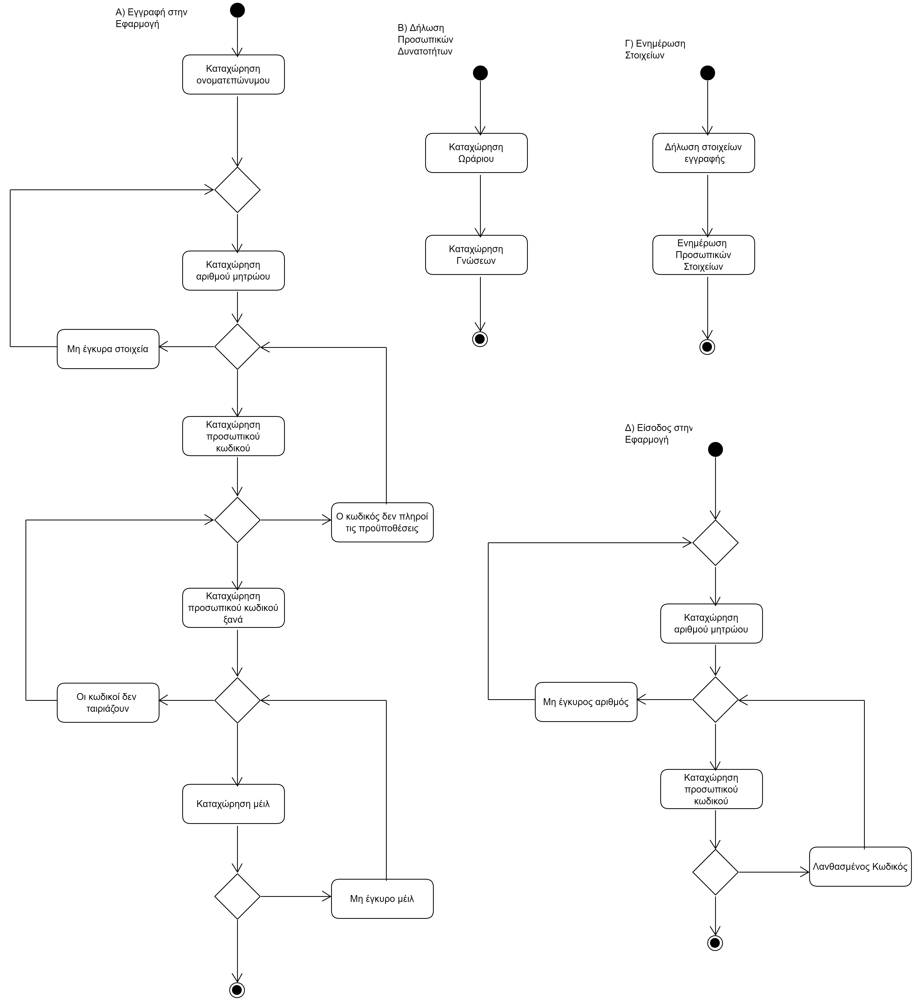

# **ΠΧ Διαχείριση Λογαριασμού**

**Πρωτεύων Actor**: Φοιτητής   
**Ενδιαφερόμενοι**:    
**Φοιτητής**: Ο φοιτητής εγγράφεται στην εφαρμογή και έπειτα διαχειρίζεται τα προσωπικά του στοιχεία όποτε θέλει.   
**Προϋποθέσεις**: -

## Βασική Ροή

### Α) Εγγραφή στην Εφαρμογή

1. Ο φοιτητής καταχωρεί το ονοματεπώνυμο του στο σύστημα.
2. Ο φοιτητής καταχωρεί τον αριθμό μητρώου του στο σύστημα.
3. Ο φοιτητής καταχωρεί τον κωδικό πρόσβασης του στο σύστημα.
4. Ο φοιτητής καταχωρεί ξανά τον κωδικό πρόσβασης του στο σύστημα για λόγους επιβεβαίωσης.
5. Ο φοιτητής καταχωρεί το μέιλ επικοινωνίας του στο σύστημα.

**Εναλλακτικές Ροές**

*2α. Ο αριθμός μητρώου που καταχωρήθηκε δεν είναι έγκυρος.*
1. Το σύστημα εμφανίζει μήνυμα σφάλματος και περιμένει νέα καταχώρηση από το χρήστη.

*3α. Ο κωδικός πρέπει να περιέχει ένα κεφαλαίο γράμμα, ένα νούμερο, και τουλάχιστον 8 χαρακτήρες.*
1. Το σύστημα εμφανίζει μήνυμα σφάλματος και περιμένει νέα καταχώρηση από το χρήστη.

*4α. Ο κωδικός που καταχωρήθηκε δεν ταιριάζει με τον προηγούμενο.*
1. Το σύστημα εμφανίζει μήνυμα σφάλματος και περιμένει νέα καταχώρηση από το χρήστη.

*5α. Το μέιλ που καταχωρήθηκε χρησιμοποιείται.*  
1. Το σύστημα εμφανίζει μήνυμα σφάλματος και περιμένει νέα καταχώρηση από το χρήστη.

*5β. Το μέιλ που καταχωρήθηκε δεν είναι έγκυρο.*
1. Το σύστημα εμφανίζει μήνυμα σφάλματος και περιμένει νέα καταχώρηση από το χρήστη.

### Β) Δήλωση Προσωπικών Δυνατοτήτων

1. Ο φοιτητής καταχωρεί τις ώρες και τις μέρες τις οποίες θα είναι διαθέσιμος στη διάρκεια του εξαμήνου.
2. Ο φοιτητής καταχωρεί τις γνώσεις που θεωρεί ότι κατέχει.

### Γ) Ενημέρωση Στοιχείων

1. Ο φοιτητής ενημερώνει τα στοιχεία εγγραφής που επιτρέπεται να επεξεργαστούν.
2. Ο φοιτητής ενημερώνει τα προσωπικά του στοιχεία.

### Δ) Είσοδος Στην Εφαρμογή

1. Ο φοιτητής καταχωρεί τον αριθμό μητρώου του στο σύστημα.
2. Ο φοιτητής καταχωρεί τον κωδικό πρόσβασης του στο σύστημα.

**Εναλλακτικές Ροές**

*1α. Ο αριθμός μητρώου που καταχωρήθηκε δεν είναι έγκυρος.*
1. Το σύστημα εμφανίζει μήνυμα σφάλματος και περιμένει νέα καταχώρηση από το χρήστη.

*2α. Ο κωδικός που καταχωρήθηκε είναι λανθασμένος.*
1. Το σύστημα εμφανίζει μήνυμα σφάλματος και περιμένει νέα καταχώρηση από το χρήστη.

## Τα αντίστοιχα διαγράμματα ροής

