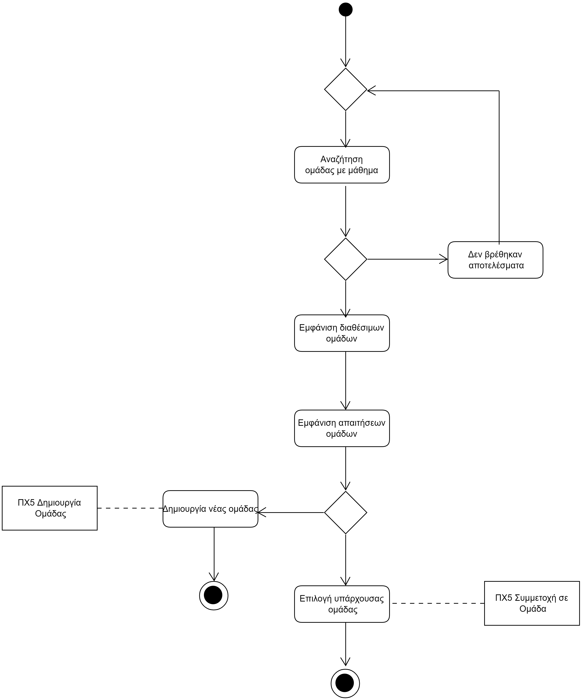

# **ΠΧ Αναζήτηση Ομάδας**

**Πρωτεύων Actor**: Φοιτητής   
**Ενδιαφερόμενοι**:    
**Φοιτητής**: Ο φοιτητής αναζητεί μία ομάδα με στόχο την εκπόνηση μίας ομαδικής εργασίας.  
**Προϋποθέσεις**: Υπάρχει ο λογαριασμός του φοιτητή στο σύστημα.

## Βασική Ροή

### Α) Αναζήτηση Ομάδας
1. Ο φοιτητής καταχωρεί τα στοιχεία του στο σύστημα για να έχει πρόσβαση στο λογαριασμό του.
2. Ο φοιτητής αναζητεί ομάδα με βάση το μάθημα που έχει καταχωρηθεί και απαιτεί ομαδική εργασία.
3. Το σύστημα εμφανίζει τις διαθέσιμες ομάδες.
4. Το σύστημα εμφανίζει τις απαιτήσεις της κάθε ομάδας. 
5. [Ο φοιτητής επιλέγει να συμμετάσχει σε μία υπάρχουσα ομάδα.](docs/markdown/team_participation.md)

**Εναλλακτικές Ροές**

*1α. Τα στοιχεία που καταχωρήθηκαν δεν είναι έγκυρα.*
1. Το σύστημα εμφανίζει μήνυμα σφάλματος και περιμένει νέα καταχώρηση από το χρήστη.

*2α. Η αναζήτηση του φοιτητή δεν ταιριάζει με τις υπάρχουσες εργασίες.*
1. Το σύστημα ενημερώνει τον φοιτητή ότι δεν υπάρχει ομαδική εργασία για αυτό το μάθημα που καταχώρησε.
2. Το σύστημα επιστρέφει τον φοιτητή στην αναζήτηση.

*5α. Ο φοιτητής επιλέγει να δημιουργήσει ο ίδιος μία νέα ομάδα.*  
 1. [Το σύστημα δίνει την επιλογή στον φοιτητή να δημιουργήσει μία ομάδα.](docs/markdown/team_creation.md)

 ## Το αντίστοιχο διάγραμμα ροής

 